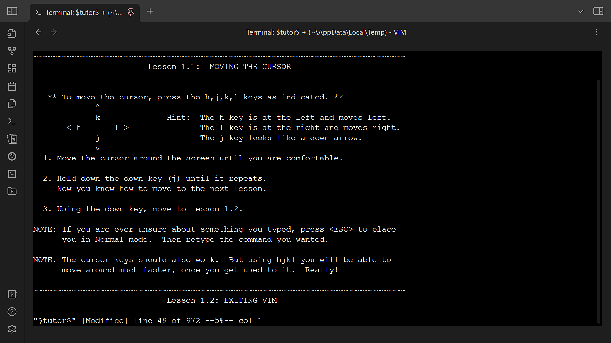

# Terminal for Obsidian

Open terminals in [Obsidian](https://obsidian.md/) directly.

- Repository: https://github.com/polyipseity/obsidian-terminal

## Features

- Open external terminals directly from Obsidian.
- Open terminals integrated into the Obsidian workspace.
- Automatically save and restore integrated terminal history across Obsidian restarts.
- Save terminal history as file.

## Usage

- To open a new external or integrated terminal
	- Context menu
		1. Right-click on files, folders, or tab headers.
		2. Choose the desired terminal action.
	- Command palette
		1. Press `Ctrl+P` or click on the `Open command palette` ribbon next to the left window border.
		2. Choose the desired terminal action.
- To save and restore integrated terminal history
	1. Keep the terminal open when exiting Obsidian.
	2. Terminal history will be restored next time Obsidian is opened.
- To save terminal history as file
	1. Right-click on the terminal tab header.
	2. Choose the desired save action.
	3. Interact with the save dialog popup.

## Installation

1. Create directory `terminal` under `.obsidian/plugins` of your vault.
2. Place `manifest.json`, `main.js`, and `styles.css` into the directory.
3. Enable the plugin.
4. (optional, recommended) Install Python and dependencies for properly resized terminals.
	1. [Download](https://www.python.org/downloads/) and install Python 3.11/+.
	2. Run `pip install psutil pywinctl`.
	3. Ensure `python` is in your `PATH`.
5. (optional) Configure plugin settings.

## Todos

- Untested on Linux and MacOS.
- Terminal addons are not working yet.
- Connect to remote shells. (could support mobile devices)
